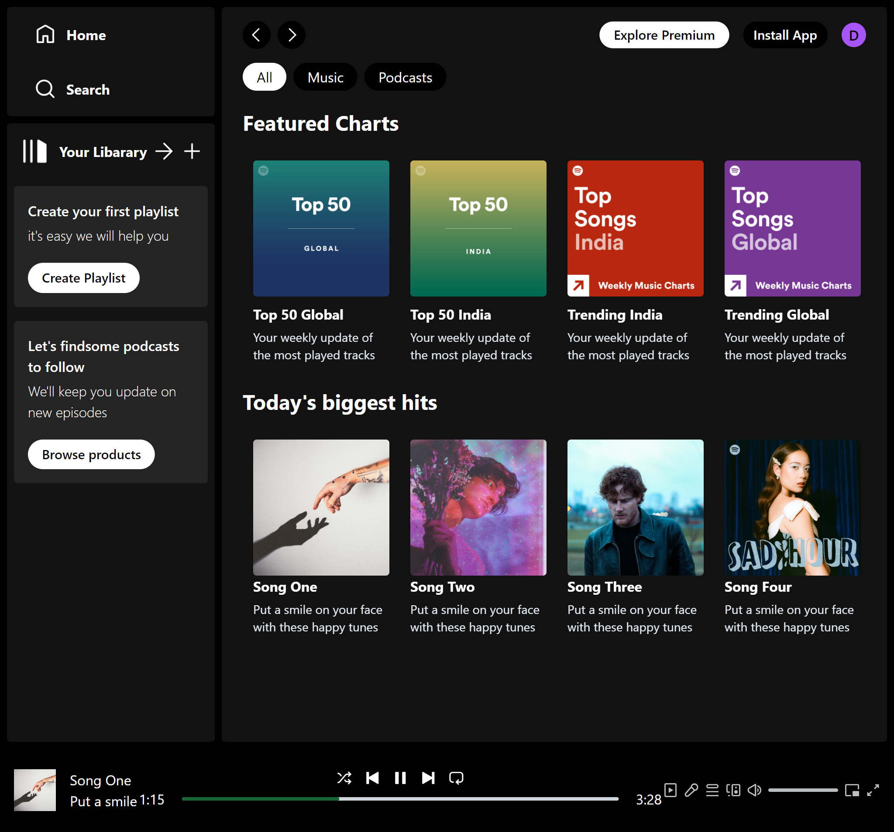

# React + Vite

This template provides a minimal setup to get React working in Vite with HMR and some ESLint rules.

Currently, two official plugins are available:

- [@vitejs/plugin-react](https://github.com/vitejs/vite-plugin-react/blob/main/packages/plugin-react/README.md) uses [Babel](https://babeljs.io/) for Fast Refresh
- [@vitejs/plugin-react-swc](https://github.com/vitejs/vite-plugin-react-swc) uses [SWC](https://swc.rs/) for Fast Refresh

# Music player Web


## Table of Contents

- [Features](#features)
- [Installation](#installation)
- [Usage](#usage)
- [Components](#components)
- [Services](#services)
- [Context](#context)
- [Contributing](#contributing)
- [License](#license)

## Features

- View a list of trending song
- Browse song
- View detailed information about selected album of song
- Responsive design

## Installation

1. Clone the repository:
   ```bash
   git clone https://github.com/Hakorimanasharif12/MC-player
   cd game-explorer
2. Install the dependencies:

## Screenshot

